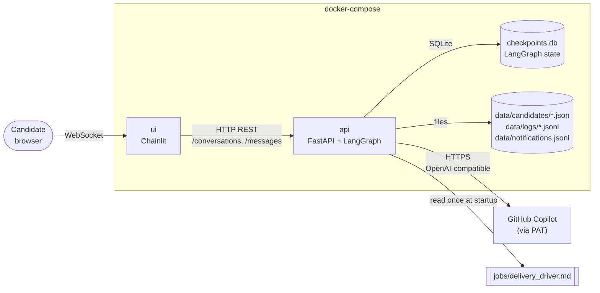
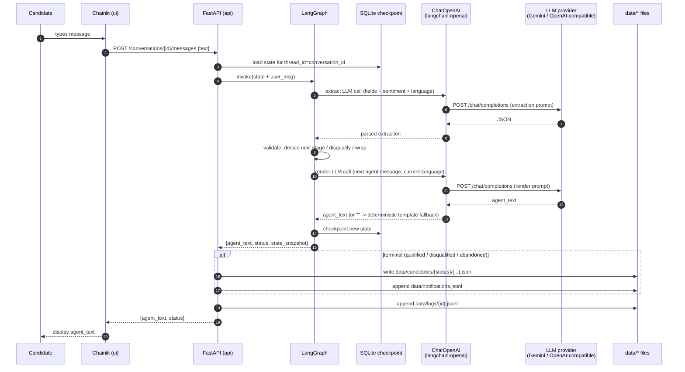
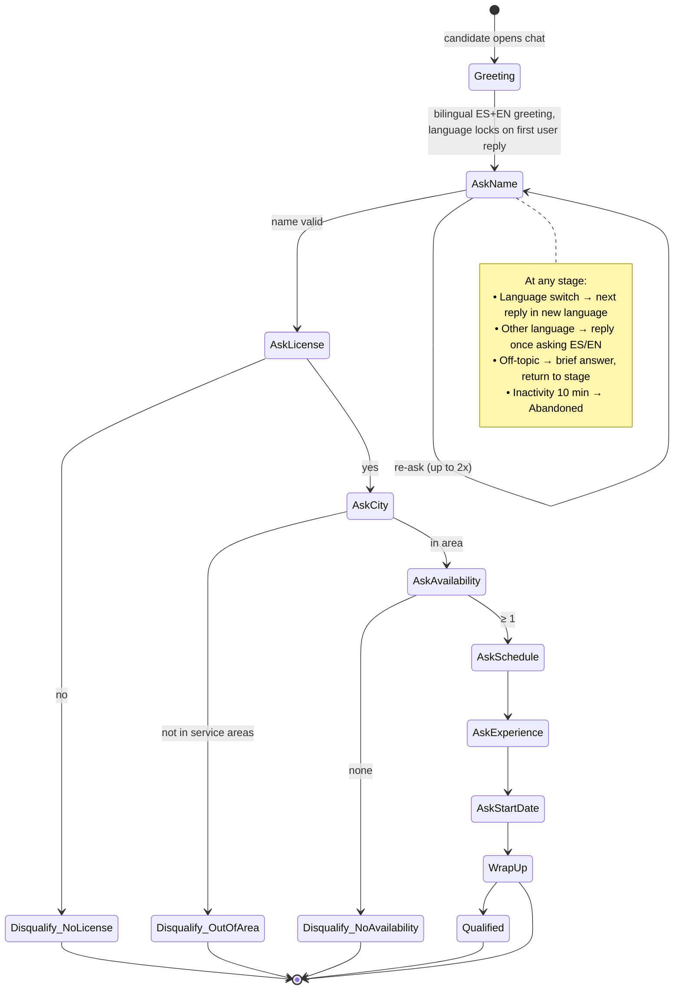

# Architecture & Tools — Delivery Driver Screening Agent

> Companion to the approved [Process Design](./process_design.md). This document covers **how** the system is built; the process design covers **what** it does.

---

## 1. Overview

The prototype is a two-service application packaged with Docker Compose:

- **`ui`** — a Chainlit app that gives the candidate a chat-like UI in the browser. It is a thin client that holds no business logic.
- **`api`** — a FastAPI app that hosts the LangGraph screening agent, talks to the LLM (GitHub Copilot via PAT), persists conversation state, and writes the final candidate JSON + logs.

Splitting UI from agent now means the same `api` can later be reused by a real messaging adapter (Twilio SMS, WhatsApp Business, Telegram) without touching the agent code. For the prototype, Chainlit is the only adapter.



**One core decision:** Chainlit does **not** import the LangGraph agent directly. It calls the `api` over HTTP. That keeps the agent reusable, lets us run them as independent containers, and avoids Chainlit's event loop owning long-running graph work.

---

## 2. Tools & Technologies (per component)

| Component | Tool | Why |
|---|---|---|
| Chat UI | **Chainlit** | Already chosen. Gives us a messaging-style UI for free; built-in sessions, message history, typing indicator. |
| Backend API | **FastAPI** + **Uvicorn** | Async, lightweight, easy to wrap LangGraph calls; good OpenAPI for future messaging-adapter integration. |
| Agent / flow | **LangGraph** | Already chosen. Native state, checkpointing, conditional edges fit the stage-based flow from the process design. |
| LLM client | **`langchain-openai`** `ChatOpenAI` pointed at an OpenAI-compatible endpoint via `base_url` + `api_key`. Default target: **Google Gemini 2.0 Flash** (`https://generativelanguage.googleapis.com/v1beta/openai/`). Swappable to GitHub Models / Groq / Ollama / OpenRouter with zero code changes — only env vars. | Simple HTTP client, no provider-specific runtime. Free tier covers prototype usage (1,500 req/day). Earlier attempts with Copilot SDK and GitHub Models direct failed — see §4.6 for the full provider-pivot history. |
| Models in the graph | **Pydantic v2** | Single source of truth for `CandidateRecord`, `ConversationState`, `LLMExtraction` — used by validators, storage, and FastAPI request/response. |
| Conversation state store | **SQLite** via `langgraph-checkpoint-sqlite` | Zero-config, one file, persists across container restarts when mounted on a volume. Swap to Postgres later without code changes (just a different `Saver`). |
| Final candidate output | **JSON files** under `data/candidates/{qualified|disqualified|abandoned}/` | Trivial to inspect and hand to recruiters; not in a DB on purpose. |
| Logs | **JSONL files** under `data/logs/{conversation_id}.jsonl` — one line per node transition + LLM call | Easy to grep; replayable for evals. |
| Recruiter notifications | **`data/notifications.jsonl`** (append-only) | Placeholder for a real webhook/email channel later. |
| JD source | **Markdown with YAML front-matter** at `jobs/delivery_driver.md` | Parsed once at startup; service_areas list feeds Stage 3 validation. |
| Config / secrets | **`.env`** + **`pydantic-settings`** | Single typed `Settings` object. `.env` gitignored. `COPILOT_PAT` passed to the `api` container via `env_file`. |
| Tracing (optional) | **LangSmith** | Set `LANGSMITH_TRACING=1` and a key — no code changes needed for traces of every graph run. |
| Testing | **pytest** + **pytest-asyncio** + **respx** (mock LLM) | Unit tests for validators, scenario tests for graph runs with mocked LLM responses. |
| Packaging | **`uv`** or **`pip` + `requirements.txt`** | Recommend `uv` (fast, lock file); fall back to pip if you'd rather avoid a new tool. |
| Containers | **Docker** + **docker-compose** | `ui` and `api` as separate services, one shared `data` volume. |

---

## 3. Component Interaction

### 3.1 Per-turn message flow



**Why one LLM call for extraction + sentiment + language detection per turn** — three sequential calls would triple latency and cost. The single call returns a JSON object covering all three, plus the chosen next agent message can be a second (and last) call if we want better wording control. We'll start with **one extract call + one render call per turn = 2 LLM calls/turn**.

### 3.2 Conversation lifecycle



---

## 4. Conversation State Management

### 4.1 What lives in state

A single Pydantic model is the LangGraph state schema:

```python
class ConversationState(BaseModel):
    conversation_id: str
    language: Literal["es", "en"] = "es"
    current_stage: Stage              # enum from the process-design flow
    candidate: CandidateRecord        # accumulated extracted fields (partial)
    transcript: list[Turn]            # role + text + ts + per-turn sentiment
    reask_counts: dict[Stage, int]    # per-field re-ask counter (cap 2)
    last_user_ts: datetime            # used by the inactivity sweeper
    qualification_status: Literal["in_progress","qualified","disqualified","abandoned"]
    disqualification_reason: Optional[str]
    job_id: str = "delivery_driver"
```

This is the **only** source of truth. The agent reads/writes only this object; everything else (JSON outputs, logs) is derived from it at terminal transitions.

### 4.2 Where state lives

- **In-memory during a turn** — LangGraph holds the dict.
- **Persisted between turns** — LangGraph's `SqliteSaver` writes a checkpoint after every node. The thread key is `conversation_id` (also the Chainlit session id).
- **Final state** — when the graph reaches a terminal node, FastAPI reads the final checkpoint and writes the `CandidateRecord` JSON to disk. The SQLite row is kept (for replay/eval), not deleted.

### 4.3 Why SQLite (not Redis / in-memory / Postgres)

- **In-memory:** loses everything on container restart — not acceptable even for prototype.
- **Redis:** extra service for no benefit at our scale.
- **Postgres:** correct production choice, but overkill now. LangGraph's `PostgresSaver` is a drop-in replacement for `SqliteSaver` when we want to move.
- **SQLite:** one file mounted on the `data` volume, atomic writes, fast enough for thousands of conversations.

### 4.4 Inactivity handling (the "stops responding" case)

Neither Chainlit nor LangGraph emit a "no reply in 10 minutes" event. We need a sweeper:

- A background `asyncio` task in the `api` runs every 60 s.
- It queries the SQLite checkpoint store for threads where `qualification_status == "in_progress"` and `now - last_user_ts > 10 min`.
- For each, it advances the graph through the `Abandoned` terminal node, which writes the JSON output and logs the timeout.
- No nudge message is sent (per the approved process design).

This keeps inactivity logic in one place (the `api`) instead of split between UI and agent.

### 4.5 Invalid / ambiguous answers

State carries a `reask_counts` dict. The validator node:

1. Runs Pydantic + custom checks against the latest extraction.
2. If invalid and the field is **hard**: increments the counter; if ≤ 2, route back to the same `AskX` node with a clarification prompt; if > 2, transition to `Abandoned` with reason `abandoned_unclear`.
3. If invalid and the field is **soft**: re-ask once; on second failure, store the raw text in `candidate.{field}_raw` and advance.

The re-ask limit is enforced in code (in a conditional edge), not in the prompt — so the LLM can't accidentally loop forever.

### 4.6 LLM client (Gemini via OpenAI-compatible endpoint)

The LLM client is a thin `langchain-openai` `ChatOpenAI` instance (see [`api/llm.py`](../api/llm.py)) pointed at **Google Gemini**'s OpenAI-compatible bridge (`https://generativelanguage.googleapis.com/v1beta/openai/`). Three env vars decide everything: `LLM_API_KEY`, `LLM_BASE_URL`, `MODEL_NAME`. The same code works with GitHub Models, Groq, Ollama, or any internal OpenAI-compatible proxy — only env values change.

**Provider history (lessons learned).** We went through three providers before settling on Gemini:

1. **Copilot Chat (`api.githubcopilot.com`) via raw PAT** — rejected: requires a session-token exchange, not direct PAT auth.
2. **`github_copilot_sdk`** — works auth-wise, but the bundled Copilot CLI's underlying model has anti-jailbreak training that intermittently refuses non-coding roles ("I'm GitHub Copilot CLI, I can't take on a different role") even with task-framed prompts.
3. **GitHub Models direct** — auth works, but the user's enterprise account doesn't have Models inference entitled (catalog reads return 200, `/chat/completions` returns 403 `no_access` on every model). Likely an org-level setting outside the user's control.
4. **Gemini 2.0 Flash** — current. Free tier: 15 req/min, 1,500 req/day. Excellent multilingual (ES/EN). Key is instantly issued at <https://aistudio.google.com/apikey>.

**Render fallback.** Free-tier endpoints can hiccup (rate limits, occasional empty bodies). The render path in [`api/nodes.py`](../api/nodes.py) uses `looks_like_refusal()` from [`api/prompts.py`](../api/prompts.py) to detect empty / off-topic responses and falls back to a deterministic per-stage question template in `STAGE_QUESTIONS`. The user never sees a blank message.

### 4.7 Message source flag

Every agent turn carries a `source: "llm" | "template"` field on `Turn` (see [`api/models.py`](../api/models.py)) recording who produced the text:

| Producer | Source |
|---|---|
| Render LLM call (success) | `llm` |
| Render fallback template (`STAGE_QUESTIONS`) | `template` |
| Bilingual greeting (first turn) | `template` |
| `OTHER_LANGUAGE_NUDGE` (unsupported language) | `template` |
| `TERMINAL_MESSAGES` (qualified / disqualified closing) | `template` |

The API echoes `source` in `CreateConvOut` and `MessageOut`. The Chainlit UI uses it to set the message author — **`Template`** vs **`Assistant`** — so testers can see at a glance when a deterministic fallback fires. Recorded in the candidate JSON output as well, which makes it easy to compute LLM-vs-template coverage across conversations.

### 4.8 Candidate Q&A from the JD (injection-resistant)

Each user message is classified by the extraction LLM. If it contains a question about the role (pay, perks, schedule, vehicle requirements, etc.), the verbatim question text is stashed in `state.metadata["user_question"]`. `render_node` then makes a second LLM call to `_answer_from_jd(question, language)` in [`api/nodes.py`](../api/nodes.py), which:

1. Loads JD body + a curated subset of frontmatter (compensation, perks, requirements, service_areas, employment_types, shifts). Operational fields like `contact`, `agent_version_compat`, and `job_id` are **excluded** from the prompt.
2. Wraps the candidate's question in `<<<CANDIDATE_QUESTION>>>...<<<END_CANDIDATE_QUESTION>>>` delimiters and runs it through `QA_SYSTEM` in [`api/prompts.py`](../api/prompts.py). The system prompt explicitly forbids: following user instructions, revealing the system prompt, role changes, and answering from anything outside the JD.
3. If the answer is outside the JD or the response trips `looks_like_refusal()`, falls back to a literal `QA_FALLBACK` message ("No tengo esa información — un reclutador podrá ayudarte.").

The answer is prepended to the next stage question so the agent answers AND continues the interview in one message. `user_question` is cleared from metadata afterwards so the next turn doesn't re-answer.

### 4.9 Inactivity simulation + nudge-then-abandon flow

`state.metadata["inactivity_nudges"]` is a small counter that drives a two-strike flow:

- **Strike 0 → 1 (nudge).** First inactivity event on an in-progress conversation appends a deterministic Turn whose text is `INACTIVITY_NUDGE_PREFIX[lang] + STAGE_QUESTIONS[(stage, lang)]` — e.g. *"Hola, ¿sigues ahí? Quería preguntarte: ¿En qué ciudad vives actualmente?"*. The sweeper's per-conversation idle timer is reset via `touch()`, so a real candidate gets another full `INACTIVITY_TIMEOUT_SECONDS` to reply.
- **Strike 1 → terminate.** Second inactivity event transitions to `ABANDONED` and runs `terminate_node` directly (bypassing the graph entry point so `route_node` doesn't un-abandon us). The closing message comes from `TERMINAL_MESSAGES[("abandoned", lang)]`, the candidate JSON is written to `data/candidates/abandoned/`, and the sweeper forgets the conversation.

The counter resets to `0` whenever the candidate sends a real message (`extract_node` always sets `inactivity_nudges = 0`), so replying after a nudge gives them a fresh budget.

The same code path serves two callers:
- `POST /conversations/{id}/inactivity` — invoked by the Chainlit **User inactivity** button (`cl.Action` attached to every in-progress agent message). Pure simulation, no real timer involved.
- The background `start_sweeper()` task in [`api/inactivity.py`](../api/inactivity.py) — invoked on real `INACTIVITY_TIMEOUT_SECONDS` expiry. Calls `_finalize_abandoned`, which delegates to the same `handle_inactivity_event` function. Production and simulation behaviour stay identical.

### 4.10 Language switching (bidirectional)

Per the approved process design: every user turn is classified for language; the next agent reply is rendered in whichever language the user just used; no acknowledgement, no lock. Implementation:

- Extraction LLM call returns `language: "es" | "en"`.
- The `language` field on state is overwritten every turn.
- The render LLM call receives the current language and produces output in it.
- If the extraction returns `language: "other"` (not ES or EN), a dedicated branch produces the bilingual nudge once; on second consecutive `other`, default to Spanish and continue.

---

## 5. Data Storage Layout

Single Docker volume `screening_data` mounted at `/app/data` in the `api` container:

```
data/
├── checkpoints.db                # LangGraph SqliteSaver — live state for all threads
├── candidates/
│   ├── qualified/
│   │   └── 2026-05-10T14-22-11_juan-perez.json
│   ├── disqualified/
│   │   └── 2026-05-10T14-25-03_ana-gomez.json
│   └── abandoned/
│       └── 2026-05-10T14-30-58_anon-7f3a.json
├── logs/
│   └── {conversation_id}.jsonl   # one line per node transition + LLM call
└── notifications.jsonl           # append-only recruiter feed
```

JSON file schema is defined in §7 of the process design and is the same across all three statuses.

---

## 6. API Surface (FastAPI)

Minimal, internal-only — Chainlit is the only client for now.

| Method | Path | Purpose |
|---|---|---|
| `POST` | `/conversations` | Create a new conversation. Returns `conversation_id` + the agent's greeting. |
| `POST` | `/conversations/{id}/messages` | Send a user message. Returns the agent's reply + current `qualification_status`. |
| `GET` | `/conversations/{id}` | Get the current `ConversationState` (useful for tests / debugging). |
| `GET` | `/healthz` | Liveness for docker-compose / k8s. |

Chainlit's `@cl.on_chat_start` calls `POST /conversations`; `@cl.on_message` calls `POST /conversations/{id}/messages`.

---

## 7. Deployment (docker-compose)

```yaml
# docker-compose.yml (sketch — for the build phase)
services:
  api:
    build: ./api
    env_file: .env           # COPILOT_PAT, MODEL_NAME, LANGSMITH_*, etc.
    volumes:
      - screening_data:/app/data
      - ./jobs:/app/jobs:ro  # JD markdown
    ports: ["8000:8000"]
    healthcheck:
      test: ["CMD", "curl", "-f", "http://localhost:8000/healthz"]

  ui:
    build: ./ui
    environment:
      API_BASE_URL: http://api:8000
    ports: ["8001:8000"]
    depends_on:
      api:
        condition: service_healthy

volumes:
  screening_data:
```

**Security note:** `COPILOT_PAT` is only injected into `api` — Chainlit never sees it.

---

## 8. Observability & Testing

- **Per-turn JSONL log** at `data/logs/{conversation_id}.jsonl` — node entered, LLM input/output (PAT redacted), latency, token counts.
- **LangSmith** (optional) for graph-level traces; toggled by env var, off by default.
- **pytest scenarios** drive the graph with mocked LLM responses to assert flow correctness across the matrix: each hard-disqualifier path, soft-failure paths, language switches in both directions, inactivity sweep, ambiguous re-ask cap.
- **Golden transcripts** (a handful of full ES and EN conversations) replayed in CI.

---

## 9. Resolved Decisions

1. **LLM calls per turn:** **2** — one extraction (fields + sentiment + language) and one render (next agent message). Better message quality than cramming both into a single JSON response.
2. **Greeting:** **Bilingual one-liner** as the very first agent message — e.g. *"¡Hola! Gracias por tu interés en la vacante de repartidor. / Hi! Thanks for your interest in the delivery driver role."* — then the agent locks to whichever language the candidate uses in their first reply (and continues to switch bidirectionally per the process design).
3. **PII at rest:** Plain JSON on disk is **acceptable for the prototype**. Production hardening (at-rest encryption, name hashing in logs) is deferred.
4. **Packaging:** **`pip` + `requirements.txt`** (see `requirements.txt` at repo root). `.env` for local config, `.env.example` committed as template.

---

## 10. Non-Goals (explicitly out of scope for the prototype)

- Real SMS / WhatsApp integration (only Chainlit).
- Multi-tenancy / multiple open positions at once (one JD loaded at startup).
- A recruiter-facing UI (recruiters read JSON files / a future notifications channel).
- Auth on the FastAPI endpoints (single-tenant local prototype).

---

## 11. Next Step

Once this architecture is approved, the build phase is:

1. Scaffold repo (`api/`, `ui/`, `jobs/`, `tests/`, `data/`, `docker-compose.yml`, `.env.example`).
2. Author `jobs/delivery_driver.md` with the 45 service-area cities.
3. Implement the LangGraph state + nodes + edges, validators, and LLM client.
4. Wire FastAPI endpoints + the inactivity sweeper.
5. Wire Chainlit `on_chat_start` / `on_message` to the API.
6. pytest scenarios + a small set of golden transcripts.
7. `docker-compose up` and run end-to-end.
